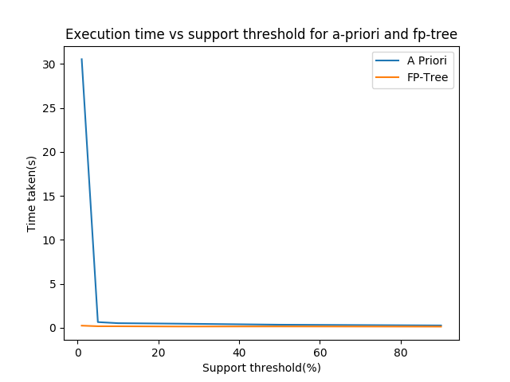
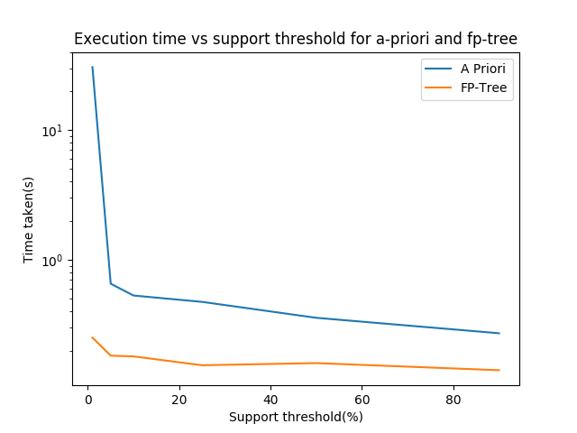

## COL 761 - Assignment 1

#### Project Structure

* C++ code - *include/* (headers) and *src/*
  * *io.cpp* - C style I/O for speed
  * *apriori.cpp* - Implementation of the a priori algorithm as discussed in class
  * *fptree.cpp* - Implementation of fp-tree construction and growth as discussed in the lectures
  * *main.cpp* - driver program
* Makefile
* Scripts - 
  * *compile.sh*
  * *2014CS50277_2014CS50279_2014CS50297.sh* - as specified in the statement
  * *plot.py* - plotting time taken vs support threshold


#### Running the code

1. To compile -

   ```bash
   ./compile.sh
   ```

2. To run - 

   ```bash
   ./2014CS50277_2014CS50279_2014CS50297.sh <input-dataset> <support-threshold> <algorithm> <output-file>
   ```

3. To compare performance - 

   ```bash
   ./2014CS50277_2014CS50279_2014CS50297.sh <input-dataset> -plot
   ```


#### A Priori vs FP-tree

| Support Threshold | Time(A priori) | Time(FP-tree) |
| :---------------: | :------------: | :-----------: |
|         1         |     31.498     |     0.234     |
|         5         |     0.662      |     0.158     |
|        10         |     0.506      |     0.157     |
|        25         |     0.440      |     0.154     |
|        50         |     0.351      |     0.153     |
|        90         |     0.270      |     0.142     |





Clearly the running time for a priori rises exponentially as the support threshold is reduced, whereas for fp-tree the running time is more or less linearly increasing. 