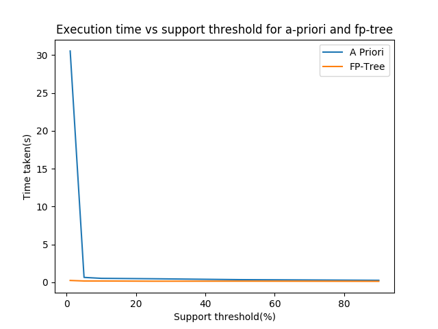
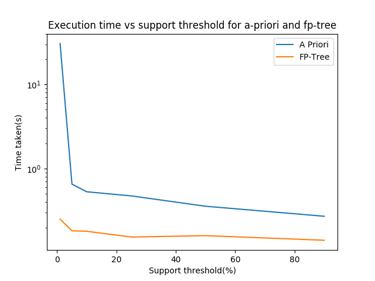

## COL 761 - Assignment 1

| Aditi Singla | Ankush Phulia | Vaibhav Bhagee |
| ------------ | ------------- | -------------- |
| 2014CS50277  | 2014CS50279   | 2014CS50297    |


#### Project Structure

* C++ code - *include/* (headers) and *src/*
  * *io.cpp* - C style I/O for speed
  * *apriori.cpp* - Implementation of the a priori algorithm as discussed in class
  * *fptree.cpp* - Implementation of fp-tree construction and growth as discussed in the lectures
  * *main.cpp* - driver program
* Makefile
* Scripts - 
  * *compile.sh*
  * *run.sh* - as specified in the statement
  * *plot.py* - plotting time taken vs support threshold


#### Running the code

1. To compile -

   ```bash
   ./run.sh
   ```

2. To run - 

   ```bash
   ./run.sh <input-dataset> <support-threshold> <algorithm> <output-file>
   ```

3. To compare performance - 

   ```bash
   ./run.sh <input-dataset> -plot
   ```


#### A Priori vs FP-tree

| Support Threshold | Time(A priori) | Time(FP-tree) |
| :---------------: | :------------: | :-----------: |
|         1         |     31.498     |     0.234     |
|         5         |     0.662      |     0.158     |
|        10         |     0.506      |     0.157     |
|        25         |     0.440      |     0.154     |
|        50         |     0.351      |     0.153     |
|        90         |     0.270      |     0.142     |





Clearly the running time for apriori rises exponentially as the support threshold is reduced, whereas for fp-tree the running time is more or less linearly increasing. This difference can be attributed to the following facts:

* Apriori algorithm uses Breadth first search approach, generating candidate itemsets which increases the execution time and is also heavy on memory. On the other hand, fp-growth algorithm uses a compressed data structure based on the concept of tries, without any candidate set generation.

* At higher support thresholds, we observe comparable running time for both the algorithms. There is a small overhead of pruning in the fp-growth algorithm (since most of the tree gets pruned each time), which compensates for the time taken in database scans in apriori. 

* As the support thresold is reduced, there is a greater chance to get *larger* frequent item sets. In case of a priori, this means that the database will be read a proportionate number of times, as opposed to a constant two for fp-tree (and insignificant change in the overhead from pruning), leading to greater increase in time for the former.

* This also explains why apriori performs better on sparse/dense datasets, while fp trees works better on large and medium datasets.