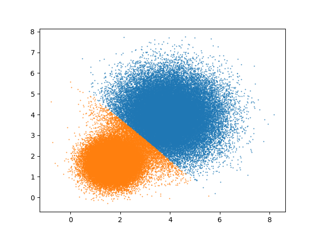
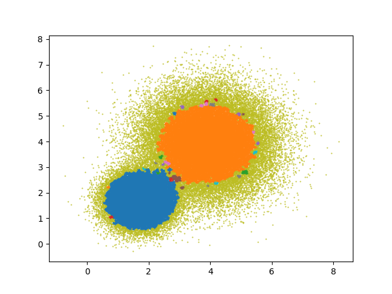
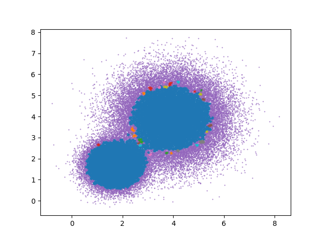
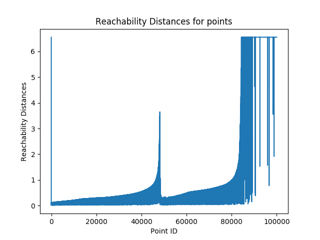

## COL 761 - Assignment 2

| Aditi Singla | Ankush Phulia | Vaibhav Bhagee |
| ------------ | ------------- | -------------- |
| 2014CS50277  | 2014CS50279   | 2014CS50297    |


#### Project Structure

* C++ code - *include/* (headers) and *src/*
  * *io.cpp* - C style I/O for speed
  * *main.cpp* - driver program
  * *kmeans.cpp* - implementation of k-means
  * *dbscan.cpp* - implementation of DBSCAN
  * *optics.cpp* - implementation of OPTICS
  * *rtree.cpp* - integration with FLANN indices
* Makefile
* Scripts -
  * *install.sh*
  * *compile.sh*
  * *run.sh*

#### Running the code

* We use the [FLANN](https://github.com/mariusmuja/flann) library for radius search and the nearest neighbour search.

* The FLANN version required is *flann-1.8.4*.

* To install FLANN on Ubuntu 16.04 -
  ```bash
   ./scripts/install.sh

* To compile -

   ```bash
   ./scripts/compile.sh

* To run the algorithms -
  * k-means

     ```bash
     ./scripts/run.sh -kmeans <k> <input file>

   * dbscan/optics

     ```bash
     ./scripts/run.sh -<dbscan/optics> <minPts> <epsilon> <input file>

#### KMeans vs DBSCAN vs OPTICS

We will illustrate the benefits of DBSCAN over KMeans and that of OPTICS over DBSCAN through a synthetic dataset.

* The [dataset](./dataset/100000-2-2.dat) contains of a set of points belonging to two, 2 - Dimensional Gaussian Distributions.
  - Distribution 1 is centered at the point *(1.7, 1.7)* with a standard deviation of *0.5*.
  - Distribution 2 is centered at the point *(3.9, 3.9)* with a standard deviation of *1.0*.

The dataset is created in such a way so that both the Gaussian Distributions have an intersection towards their periphery.

##### KMeans vs DBSCAN

We know that KMeans can't outperform clustering algorithms which estimate the Density of the point distribution, as is the case with this dataset. Here, The clustering obtained by KMeans is as follows:



Here, we see that the k-means algorithm classifies some points of the bigger gaussian cluster as belonging to the other smaller cluster. This is because, in k-means, these points are closer to the cluster center of the smaller cluster, distance wise.

Running the DBSCAN algorithm on the same dataset with *minPts = 26* and *epsilon = 0.055* gives the clustering as follows:



Here we see that the DBSCAN algorithms is able to perform a good density estimation of the dataset of points and is able to give a better classification over the k-means algorithm.

##### DBSCAN vs OPTICS

The issue with the DBSCAN algorithm is that we have to identify a suitable value of *epsilon* for a given value of *minPts* to be able to extract a meaningful clustering out of the dataset. 

For eg. running the DBSCAN algorithm on the same dataset with *minPts = 26* and *epsilon = 0.056* gives the clustering as follows:



Here we see that the DBSCAN algorithms is not able to perform a good density estimation of the dataset of points and it clusters the elements of both the clusters into 1 big cluster when the chosen value of *epsilon* is increased by *0.001*. 

OPTICS helps us to get rid of this requirement of tuning the *epsilon*. 
If we now run the OPTICS algorithm on the same dataset with *minPts = 26* and *maxEpsilon = 0.056*, we get the following reachability plot:



Here we see that by inspecting the reachability plot, we are able to see the transition value for the reachability distance where we get two clusters instead of one. This allows us to extract a meaningful DBSCAN clustering out, for *epsilon* values less that the *maxEpsilon* value set in the OPTICS algorithms.
