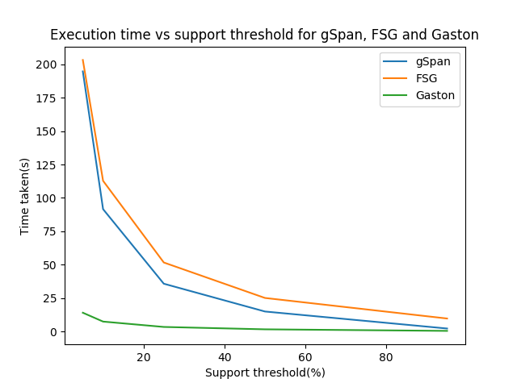
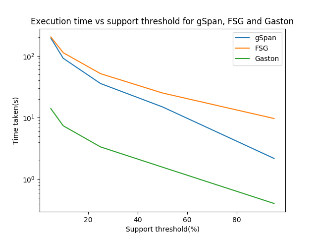

## COL 761 - Assignment 3

| Aditi Singla | Ankush Phulia | Vaibhav Bhagee |
| ------------ | ------------- | -------------- |
| 2014CS50277  | 2014CS50279   | 2014CS50297    |


#### Project Structure

* C++ code - *include/* (headers) and *src/*
  * *main.cpp* - driver program
* Makefile
* Scripts - 
  * *install.sh*
  * *format.py*
  * *plot.py*
  * *compile.sh*
  * *classify.sh*


#### Running the code

1. To compile -

   ```bash
   ./scripts/compile.sh
   ```

2. To run -

   1. Comparison between gSpan, FSG and Gaston

      ```bash
      python scripts/plot.py <input-data> --supports <list of frequency thresholds>
      ```

   2. Generation of train/test set for classification

      ```bash
      ./scripts/classify.sh <train-data> <active-ids> <inactive-ids> <test-data>
      ```

#### Graphs

Comparision for execution time for `gSpan`, `fsg` and `gaston` at support thresholds 5, 10, 25, 50, 95:


